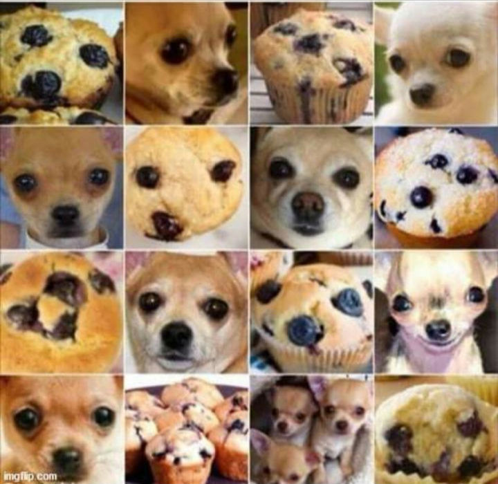
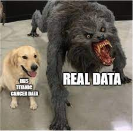
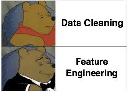
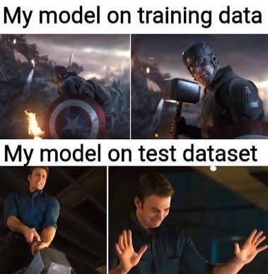

# Selector Project

## Deskripsi

Selector adalah sebuah proyek klasifikasi gambar khusus yang dibuat untuk mengenali karakter anime, yaitu `Takina Inoue` (dari anime "Lycoris Recoil") dan `Shibuya Rin` (dari anime "Idolmaster Cinderella Girls").

Proyek ini menggunakan metode algoritma klasifikasi seperti SVM, Logistik Logaritm, dan juga Random Forest.
untuk model machine learning saya menggunakan pakage / library dari `sklearn`.

## Motivasi

Motivasi dari Project ini adalah lagi mencari meme berkaitan dengan image clasification,image segmentation dan juga machine learning.
dari gambar di bawah ini pasti sering lihat meme seperti ini

dari meme tersebut kepikiran ada dua karakter anime yang gambar style nya mirip.

seperti di bawah ini

  
  

dari gambar tersebut terpikir lah untuk membuat project `Selector`.

## Metode

Metode yang saya gunakan adalah

### 1. Scrapping Data
Data Image ini di ambil dari Pinterest dengan menggunakan BeautifulSoup,numpy,cv2 dan pydotmap

### 2. Data Cleaning
Data Cleaning konsepnya dimana karakter anime ini bisa di deteksi dengan menggunakan opencv.kenapa harus menggunakan itu? karena
karakter tersebut bisa di deteksi hanya dari wajah dan juga mata dari
karakter tersebut.
dan juga dari image yang telah di crop

### 3. Data Features
Data feature ini merupakan bagaimana cara dari gambar yang di crop diubah ke dalam bentuk array 3 Dimensi dan juga gambar tersebut juga di Flatten.dan gambar tersebut udah di kasih label sesuai yang telah di folder `dataset`.

### 4. Modeling
Setelah siap dan data image yang sudah di flatten udah dalam bentuk pandas DataFrame
abis itu mari kita bikin paramater setiap algoritma di pakai seperti `logistik linear`,`Support Vector Machine.` dan `Random Forest`.
setelah itu cari yang dimana algoritma menghasilkan best_score maksimal.setelah itu simpan model tersebut.
